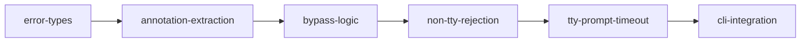

# Implementation Plan: Approval Gate (Rust)

**Feature ID**: FE-03
**Status**: planned
**Priority**: P1
**Source Spec**: apcore-cli/docs/features/approval-gate.md
**SRS Requirements**: FR-APPR-001 through FR-APPR-005

---

## Goal

Port the TTY-aware Human-in-the-Loop (HITL) approval gate from Python to Rust. The gate intercepts module execution when `annotations.requires_approval` is exactly `true` (strict boolean), prompts interactive users for confirmation via a 60-second timed TTY prompt, and blocks non-interactive callers without a bypass. Bypass mechanisms (`--yes` flag and `APCORE_CLI_AUTO_APPROVE=1` env var) must be preserved with identical priority semantics.

The primary Rust challenge is that SIGALRM is Unix-only and interferes with Tokio's async runtime. The timeout must instead be implemented with `tokio::select!` racing `tokio::task::spawn_blocking` (blocking stdin readline) against `tokio::time::sleep(Duration::from_secs(60))`.

---

## Architecture Design

### Module: `src/approval.rs`

The existing file already declares the `ApprovalError` enum skeleton and a stub `check_approval` function. This plan fills in the full implementation.

### Key Types

```rust
// thiserror-derived error enum — all variants map to exit code 46
#[derive(Debug, Error)]
pub enum ApprovalError {
    #[error("approval denied for module '{module_id}'")]
    Denied { module_id: String },

    #[error("no interactive TTY available for approval prompt")]
    NonInteractive { module_id: String },

    #[error("approval timed out after {seconds}s for module '{module_id}'")]
    Timeout { module_id: String, seconds: u64 },
}
```

### Function Signatures

```rust
// Main entry point — async because tokio::select! is used in the TTY path.
pub async fn check_approval(
    module_def: &serde_json::Value,
    auto_approve: bool,
) -> Result<(), ApprovalError>

// Internal: extract requires_approval from annotations value (strict bool).
fn get_requires_approval(annotations: &serde_json::Value) -> bool

// Internal: extract optional approval_message string from annotations.
fn get_approval_message(annotations: &serde_json::Value, module_id: &str) -> String

// Internal: display prompt and race stdin against 60s timeout.
async fn prompt_with_timeout(module_id: &str, message: &str, timeout_secs: u64)
    -> Result<(), ApprovalError>
```

### Control Flow

```
check_approval(module_def, auto_approve)
  |
  +-- annotations absent or requires_approval != true (strict bool)?
  |     --> Ok(()) immediately
  |
  +-- auto_approve == true?
  |     --> tracing::info!("bypassed via --yes flag") --> Ok(())
  |
  +-- env APCORE_CLI_AUTO_APPROVE == "1"?
  |     --> tracing::info!("bypassed via APCORE_CLI_AUTO_APPROVE") --> Ok(())
  |
  +-- env APCORE_CLI_AUTO_APPROVE set but != "1"?
  |     --> tracing::warn!("expected '1'. Ignoring.")
  |
  +-- std::io::stdin().is_terminal() == false?
  |     --> eprintln!("Error: Module '{id}' requires approval but no interactive ...")
  |     --> tracing::error!("Non-interactive environment, ...")
  |     --> Err(ApprovalError::NonInteractive { module_id })
  |
  +-- TTY path --> prompt_with_timeout(module_id, message, 60)
        |
        +-- tokio::select! {
        |     result = spawn_blocking(|| stdin_readline()) => {
        |       "y" | "yes" (case-insensitive) --> Ok(())
        |       anything else --> Err(ApprovalError::Denied)
        |     }
        |     _ = tokio::time::sleep(Duration::from_secs(60)) => {
        |       Err(ApprovalError::Timeout)
        |     }
        |   }
```

### Annotations Extraction

`module_def` is a `serde_json::Value` (JSON object). The function reads:
- `module_def["annotations"]["requires_approval"]` — must be `Value::Bool(true)`, nothing else.
- `module_def["annotations"]["approval_message"]` — optional string; falls back to default message.
- `module_def["module_id"]` or `module_def["canonical_id"]` — for log and error messages.

This mirrors the Python implementation's `_get_annotation` helper: string `"true"`, integer `1`, and `null` all fail the strict boolean check.

### Exit Code Mapping

All `ApprovalError` variants map to exit code `46` (`EXIT_APPROVAL_DENIED`), already declared in `src/lib.rs`. The caller (`main.rs` or the CLI dispatcher) is responsible for converting `Err(ApprovalError::*)` into `std::process::exit(46)`.

### TTY Detection

Use `std::io::IsTerminal` (stable since Rust 1.70):

```rust
use std::io::IsTerminal;
let is_tty = std::io::stdin().is_terminal();
```

No platform-specific code is required — `IsTerminal` handles Windows, Unix, and pseudo-TTY correctly.

### Timeout Implementation (No SIGALRM)

```rust
use tokio::task::spawn_blocking;
use tokio::time::{sleep, Duration};

let read_handle = spawn_blocking(|| {
    let mut line = String::new();
    std::io::stdin().read_line(&mut line)?;
    Ok::<String, std::io::Error>(line.trim().to_lowercase())
});

tokio::select! {
    result = read_handle => { /* handle y/yes vs denial */ }
    _ = sleep(Duration::from_secs(timeout_secs)) => { /* timeout path */ }
}
```

The stdin read runs on the blocking thread pool (not the async executor), so it does not block Tokio's worker threads. On timeout, the `select!` branch fires and the function returns `Err(ApprovalError::Timeout {...})`. The blocking thread may remain parked until the process exits — this is acceptable; the process exits immediately with code 46.

---

## Task Breakdown

### Dependency Graph



### Task List

| ID | Title | Estimate |
|----|-------|----------|
| `error-types` | Define `ApprovalError` enum with `thiserror` | ~30 min |
| `annotation-extraction` | Implement `get_requires_approval` and `get_approval_message` helpers | ~45 min |
| `bypass-logic` | Implement `--yes` flag and `APCORE_CLI_AUTO_APPROVE` bypass in `check_approval` | ~45 min |
| `non-tty-rejection` | Implement TTY detection and `NonInteractive` error path | ~30 min |
| `tty-prompt-timeout` | Implement `prompt_with_timeout` with `tokio::select!` and `spawn_blocking` | ~1.5 hr |
| `cli-integration` | Wire `check_approval` into the CLI dispatcher; map `ApprovalError` to exit 46 | ~45 min |

---

## Risks

| Risk | Severity | Mitigation |
|------|----------|------------|
| Blocking thread not released on timeout | Low | Acceptable — process exits immediately with code 46; no resource leak in practice. |
| `is_terminal()` behavior in CI/test environments | Medium | Tests must use dependency injection or a `#[cfg(test)]` mock for TTY state rather than calling `is_terminal()` directly. |
| `spawn_blocking` panics if Tokio runtime is not active | Low | `check_approval` is `async fn`; callers must already be inside a Tokio runtime (`#[tokio::main]`). Document this requirement. |
| Strict bool check divergence | High | Unit tests must explicitly cover `"true"` string, `1` integer, and `null` to prevent regression against FR-03-01. |
| `tokio::select!` cancels the blocking read on timeout | Medium | The abandoned thread will stay blocked on `read_line` until EOF or process exit. Write a test note documenting this is expected behavior. |

---

## Acceptance Criteria

All criteria map directly to the verification table in the feature spec (T-APPR-01 through T-APPR-13).

- [ ] T-APPR-01: `requires_approval: true`, TTY, user types `y` → `Ok(())`, INFO logged.
- [ ] T-APPR-02: `requires_approval: true`, TTY, user types `n` → `Err(Denied)`, exit 46.
- [ ] T-APPR-03: `requires_approval: true`, TTY, user presses Enter → `Err(Denied)`, exit 46 (default deny).
- [ ] T-APPR-04: `requires_approval: true`, non-TTY, no bypass → `Err(NonInteractive)`, exit 46, stderr contains "no interactive terminal".
- [ ] T-APPR-05: `--yes` flag → `Ok(())`, INFO log contains "bypassed via --yes flag".
- [ ] T-APPR-06: `APCORE_CLI_AUTO_APPROVE=1` → `Ok(())`, INFO log contains "bypassed via APCORE_CLI_AUTO_APPROVE".
- [ ] T-APPR-07: `APCORE_CLI_AUTO_APPROVE=true` → WARNING logged, bypass NOT active.
- [ ] T-APPR-08: `requires_approval: false` → `Ok(())` immediately, no prompt.
- [ ] T-APPR-09: No `annotations` field → `Ok(())` immediately, no prompt.
- [ ] T-APPR-10: TTY prompt, 60 s timeout → `Err(Timeout)`, exit 46, stderr contains "timed out after 60 seconds".
- [ ] T-APPR-11: Both `--yes` and `APCORE_CLI_AUTO_APPROVE=1` → `--yes` takes priority, log says "bypassed via --yes flag".
- [ ] T-APPR-12: Custom `approval_message` annotation → custom message written to stderr before prompt.
- [ ] T-APPR-13: No `approval_message` → default message "Module '{id}' requires approval to execute." written to stderr.
- [ ] All unit tests pass: `cargo test --lib approval`.
- [ ] Compilation: `cargo build` produces zero warnings.

---

## References

- Feature spec: `apcore-cli/docs/features/approval-gate.md` (FE-03)
- Python implementation: `apcore-cli-python/src/apcore_cli/approval.py`
- Python planning: `apcore-cli-python/planning/approval-gate.md`
- Type mapping: `apcore/docs/spec/type-mapping.md` (bool → Rust `bool`, strict JSON `true`/`false`)
- Existing stub: `apcore-cli-rust/src/approval.rs`
- Exit codes: `apcore-cli-rust/src/lib.rs` (`EXIT_APPROVAL_DENIED = 46`)
- `std::io::IsTerminal`: https://doc.rust-lang.org/std/io/trait.IsTerminal.html (stable 1.70)
- `tokio::task::spawn_blocking`: https://docs.rs/tokio/latest/tokio/task/fn.spawn_blocking.html
- `tokio::select!`: https://docs.rs/tokio/latest/tokio/macro.select.html
