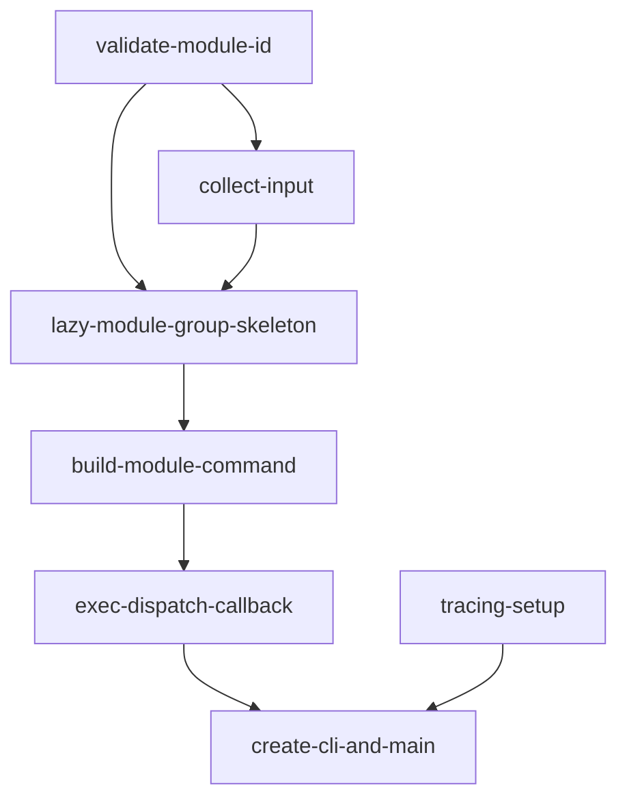

# Implementation Plan: Core Dispatcher (Rust)

**Feature ID**: FE-01
**Status**: planned
**Priority**: P0
**Target Language**: Rust 2021
**Source Spec**: `apcore-cli/docs/features/core-dispatcher.md`
**SRS Requirements**: FR-DISP-001, FR-DISP-002, FR-DISP-003, FR-DISP-004

---

## Goal

Port the Python `core-dispatcher` feature (FE-01) to Rust. The Rust implementation must provide the same external contract as the Python version: dynamic module subcommand dispatch, STDIN JSON input merging, module ID validation, extensions directory loading, and precise exit code semantics — all implemented using idiomatic Rust with the project's declared tech stack (Rust 2021, tokio, clap v4, serde_json, thiserror, anyhow, dirs).

**Correctness invariants that must be preserved across the port:**

- Exit codes: 0, 1, 2, 44, 45, 46, 47, 48, 77, 130 — exact numeric values, no substitutions.
- STDIN limit: 10 MiB (10,485,760 bytes) by default; bypassed with `--large-input`.
- Module ID regex: `^[a-z][a-z0-9_]*(\.[a-z][a-z0-9_]*)*$`, max 128 chars.
- CLI flags override STDIN JSON for duplicate keys.
- Program name resolved from `argv[0]` basename; explicit `prog_name` overrides.
- Built-in commands: `exec`, `list`, `describe`, `completion`, `man`.

---

## Architecture Design

### Clap v4 — No Lazy Group Equivalent

Python's `LazyModuleGroup` subclasses `click.Group` and overrides `list_commands` / `get_command` to build subcommands on demand. Clap v4 has no equivalent hook. The Rust approach uses two patterns depending on context:

1. **`--extensions-dir` pre-parse**: Done in `extract_extensions_dir()` by walking `std::env::args()` before clap runs, mirroring the Python `_extract_extensions_dir` function. This is required because the registry must be instantiated before the clap `Command` tree is assembled.

2. **Dynamic module dispatch via `external_subcommand`**: The root `Command` is configured with `.allow_external_subcommands(true)`. When clap encounters an unrecognised subcommand, the remaining `argv` is captured as `Vec<OsString>` under the `external_subcommand` match arm. The dispatcher then validates the module ID, fetches its definition from the registry, merges input, and calls the executor — all in the `main` async body without needing clap to know about the module's schema-derived flags at parse time.

   The alternative (adding one `clap::Command` per module to the tree at startup) would violate the NFR-PERF-001 startup target of 100 ms for registries with up to 1,000 modules.

3. **Built-in subcommands**: `list`, `describe`, `completion`, `man`, and `exec` are registered as first-class `clap::Command` subcommands in the static tree. The `exec` subcommand accepts a positional `MODULE_ID` argument plus `--input`, `--yes`, `--large-input`, `--format`, `--sandbox`, and catches remaining args as `--key value` pairs for schema-driven fields.

### Module Layout

```
src/
  main.rs          — binary entry point: extract_extensions_dir, create_cli, main
  cli.rs           — LazyModuleGroup struct, build_module_command, collect_input,
                     validate_module_id, set_audit_logger, error codes
  lib.rs           — crate root, exit code constants, pub re-exports
  config.rs        — ConfigResolver (already stubbed)
  ...
```

### Key Data-Flow

```
argv
  │
  ├─ extract_extensions_dir()  [pre-parse, O(n) argv scan]
  │
  └─ create_cli(ext_dir, prog_name)
       │
       ├─ resolve log level (APCORE_CLI_LOGGING_LEVEL > APCORE_LOGGING_LEVEL > WARNING)
       ├─ validate extensions dir (exit 47 if missing/unreadable)
       ├─ Registry::new(ext_dir).discover()
       ├─ Executor::new(&registry)
       ├─ AuditLogger::new() → set_audit_logger(Some(logger))
       └─ build clap::Command tree
            ├─ built-in subcommands (list, describe, completion, man, exec)
            └─ .allow_external_subcommands(true)

dispatch loop (in main):
  match subcommand {
    "list"     => discovery::cmd_list(...)
    "describe" => discovery::cmd_describe(...)
    "exec"     => dispatch_exec(module_id, args, registry, executor)
    external   => dispatch_module(name, args, registry, executor)
  }

dispatch_module / dispatch_exec:
  validate_module_id(id)          → exit 2 on failure
  registry.get_definition(id)     → exit 44 on None
  collect_input(stdin, kwargs, large_input)
  schema validation (jsonschema or serde)
  check_approval(id, auto_approve)
  executor.call(id, merged)       → audit log + format_exec_result
```

### `LazyModuleGroup` in Rust

Even without clap lazy groups, `LazyModuleGroup` is retained as a struct that:

- Holds `Arc<dyn Registry>` and `Arc<dyn Executor>`.
- Provides `list_commands() -> Vec<String>` (builtins + registry IDs, sorted).
- Provides `get_command(name: &str) -> Option<clap::Command>` with an internal `HashMap` cache.
- Is used by `create_cli` to enumerate subcommands for `--help` display and by `dispatch_module` for runtime dispatch.

The struct is not a clap extension; it is a plain dispatcher helper called from `main`.

### Error Code Mapping

```rust
match apcore_error_code {
    "MODULE_NOT_FOUND" | "MODULE_LOAD_ERROR" | "MODULE_DISABLED" => 44,
    "SCHEMA_VALIDATION_ERROR"                                     => 45,
    "APPROVAL_DENIED" | "APPROVAL_TIMEOUT" | "APPROVAL_PENDING"  => 46,
    "CONFIG_NOT_FOUND" | "CONFIG_INVALID"                         => 47,
    "SCHEMA_CIRCULAR_REF"                                         => 48,
    "ACL_DENIED"                                                  => 77,
    "MODULE_EXECUTE_ERROR" | "MODULE_TIMEOUT"                     => 1,
    _                                                             => 1,
}
```

Exit 130 is produced by catching `tokio::signal::ctrl_c()` or by intercepting a `SIGINT` via `ctrlc` / tokio signal handling before the executor returns.

### STDIN Reading

```rust
use std::io::Read;
const STDIN_LIMIT: usize = 10 * 1024 * 1024; // 10 MiB

fn read_stdin(large_input: bool) -> Result<Vec<u8>, CliError> {
    let mut buf = Vec::new();
    std::io::stdin().read_to_end(&mut buf)?;
    if !large_input && buf.len() > STDIN_LIMIT {
        return Err(CliError::InputTooLarge { limit: STDIN_LIMIT, actual: buf.len() });
    }
    Ok(buf)
}
```

The byte limit is checked on raw bytes (not UTF-8 decoded chars), matching the Python `len(raw.encode('utf-8'))` semantics.

### Log Level

`tracing-subscriber` with `EnvFilter` is used. The three-tier precedence is replicated by:

1. Reading `APCORE_CLI_LOGGING_LEVEL` then `APCORE_LOGGING_LEVEL` at startup.
2. Constructing an `EnvFilter` string from the resolved level.
3. Allowing the `--log-level` flag to re-initialise the filter at parse time using `tracing_subscriber::reload`.

---

## Task Breakdown

### Dependency Graph



### Task List

| Task ID | Title | Estimate |
|---------|-------|----------|
| `validate-module-id` | Implement and test `validate_module_id` | ~2h |
| `collect-input` | Implement and test `collect_input` with STDIN byte-limit and JSON validation | ~3h |
| `lazy-module-group-skeleton` | Implement `LazyModuleGroup` struct with `list_commands` and `get_command` | ~3h |
| `build-module-command` | Implement `build_module_command` — schema → clap Args, built-in flags, name/about | ~3h |
| `exec-dispatch-callback` | Implement the full exec callback: input → validation → approval → executor → audit → output | ~4h |
| `create-cli-and-main` | Implement `create_cli`, `extract_extensions_dir`, `main`, tracing setup, exit-47 guard | ~4h |

---

## Risks and Considerations

### Clap v4 Dynamic Dispatch

**Risk**: `allow_external_subcommands` captures *all* unrecognised arguments, including typos. The dispatcher must produce "command not found" (exit 44) rather than a clap usage error (exit 2) when the module ID does not exist in the registry.

**Mitigation**: After clap captures the external subcommand name, call `validate_module_id` (exit 2 on bad format) then `registry.get_definition` (exit 44 on `None`). This preserves the same error-code semantics as the Python implementation.

### `LazyModuleGroup` Help Text

**Risk**: With `allow_external_subcommands`, clap cannot enumerate dynamic modules in `--help` output. The Python version calls `list_commands` which returns built-ins + module IDs sorted.

**Mitigation**: Override `before_help` or use a custom `help_template` on the root `Command` that calls `lazy_group.list_commands()` to inject a module listing section. This is display-only and does not affect dispatch.

### STDIN Injection in Tests

**Risk**: `collect_input` reads from `std::io::stdin()`, making unit tests non-trivial. The Python tests mock `sys.stdin`.

**Mitigation**: Refactor `collect_input` to accept a `impl Read` parameter instead of hard-coding `stdin()`. In production, pass `std::io::stdin()`. In tests, pass a `std::io::Cursor<Vec<u8>>`. The public signature remains backward-compatible by providing a wrapper `collect_input_from_stdin(flag, kwargs, large_input)` that calls the inner function.

### Exit Code 130 (SIGINT)

**Risk**: Rust does not propagate `SIGINT` as a `panic` or `Err`. Without explicit signal handling, the process receives `SIGINT` and exits with platform-default behaviour (often exit 130 on Unix, but not guaranteed).

**Mitigation**: Use `tokio::select!` in the `main` execution path to race the executor future against `tokio::signal::ctrl_c()`. On signal receipt, write "Execution cancelled." to stderr and call `std::process::exit(130)`.

### `Mutex<Option<AuditLogger>>` vs `OnceLock`

**Risk**: The existing `static AUDIT_LOGGER: Mutex<Option<AuditLogger>>` in `cli.rs` requires a lock acquisition on every module execution.

**Mitigation**: Retain the `Mutex` approach (matches the existing stub) to avoid changing the public API of `set_audit_logger`. Document that `set_audit_logger` is called once at startup. Consider migrating to `std::sync::OnceLock<AuditLogger>` in a future refactor once `AuditLogger` is known to be `Send + Sync`.

### `regex` Crate Not in Cargo.toml

**Risk**: `validate_module_id` requires regex matching. The `regex` crate is not listed in `Cargo.toml`.

**Mitigation**: Either add `regex = "1"` to `[dependencies]`, or implement the module ID check using a hand-written character-by-character validator (avoids a new dependency). The hand-written approach is sufficient given the simple grammar and is preferred to keep the dependency footprint small.

---

## Acceptance Criteria

All acceptance criteria from the Python implementation apply verbatim, verified via `cargo test` and integration tests in `tests/test_cli.rs` and `tests/test_e2e.rs`.

| Test ID | Description | Expected |
|---------|-------------|----------|
| T-DISP-01 | `apcore-cli --help` with valid extensions | output contains "list", "describe", module IDs; exit 0 |
| T-DISP-02 | `apcore-cli --version` | `apcore-cli, version X.Y.Z`; exit 0 |
| T-DISP-03 | `apcore-cli exec non.existent` | stderr "not found"; exit 44 |
| T-DISP-04 | `apcore-cli exec "INVALID!ID"` | stderr "Invalid module ID format"; exit 2 |
| T-DISP-05 | `apcore-cli exec math.add --a 5 --b 10` | stdout module result; exit 0 |
| T-DISP-06 | `echo '{"a":5}' \| apcore-cli exec math.add --input -` | module receives `{a:5}`; exit 0 |
| T-DISP-07 | STDIN + CLI flag overlap; CLI wins | module receives CLI value; exit 0 |
| T-DISP-08 | 15 MB pipe without `--large-input` | stderr "exceeds 10MB limit"; exit 2 |
| T-DISP-09 | invalid JSON pipe | stderr "does not contain valid JSON"; exit 2 |
| T-DISP-10 | `APCORE_EXTENSIONS_ROOT=/tmp/test` | modules loaded from `/tmp/test` |
| T-DISP-11 | extensions dir missing | stderr "not found"; exit 47 |
| T-DISP-13 | `--extensions-dir` overrides `APCORE_EXTENSIONS_ROOT` | CLI flag path used |
| T-DISP-14 | default entry point `--version` | `apcore-cli, version X.Y.Z`; exit 0 |
| T-DISP-16 | `create_cli(prog_name="custom-name") --help` | help contains `custom-name` |
| T-DISP-17 | `create_cli(prog_name=None)` uses `argv[0]` basename | help contains argv[0] name |

Additional Rust-specific criteria:

- `cargo test` passes with zero `assert!(false, "not implemented")` assertions.
- `cargo clippy -- -D warnings` produces no warnings.
- `cargo build --release` succeeds with binary size under 10 MB.
- Startup time under 100 ms measured via `hyperfine 'apcore-cli --help'` with a populated extensions directory.

---

## References

- Feature spec: `apcore-cli/docs/features/core-dispatcher.md`
- Python implementation: `apcore-cli-python/src/apcore_cli/cli.py`, `apcore_cli/__main__.py`
- Python planning: `apcore-cli-python/planning/core-dispatcher.md`
- Type mapping spec: `apcore/docs/spec/type-mapping.md`
- Existing stubs: `apcore-cli-rust/src/cli.rs`, `apcore-cli-rust/src/main.rs`
- Existing tests: `apcore-cli-rust/tests/test_cli.rs`
- clap v4 docs: https://docs.rs/clap/latest/clap/
- tokio signal handling: https://docs.rs/tokio/latest/tokio/signal/
