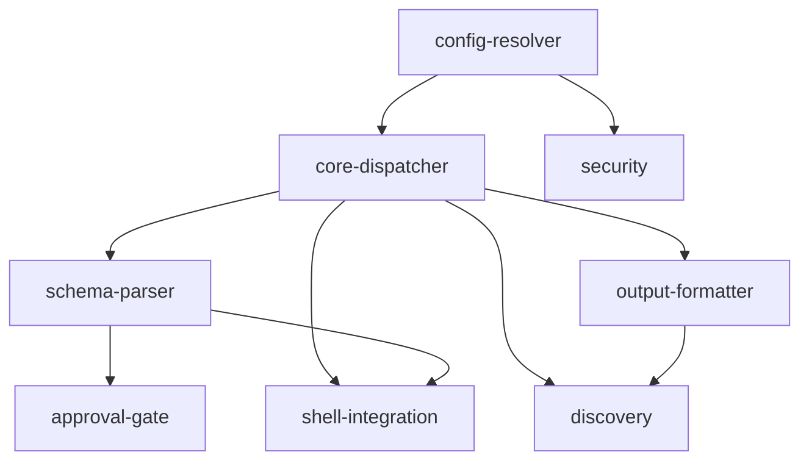

# apcore-cli-rust — Project Overview

> Rust 2021 port of `apcore-cli-python`. All eight feature modules are planned and pending implementation.

---

## Overall Progress

```
[░░░░░░░░░░░░░░░░░░░░░░░░░░░░░░░░░░░░░░░░] 0 / 41 tasks complete (0%)
```

| Stat | Count |
|---|---|
| Total modules | 8 |
| Pending | 8 |
| In progress | 0 |
| Complete | 0 |
| Total tasks | 41 |

---

## Module Overview

| # | Module | Description | Status | Tasks |
|---|---|---|---|---|
| 1 | [config-resolver](config-resolver/) | 4-tier configuration precedence hierarchy (CLI flag > env var > YAML file > built-in default). Foundational, dependency-free module required by all features that read user-configurable values. | pending | 3 |
| 2 | [core-dispatcher](core-dispatcher/) | Primary CLI entry point. Resolves extensions directory, builds the clap command tree, dispatches to built-in or dynamic module commands, enforces exit codes, and audit-logs execution results. | pending | 6 |
| 3 | [schema-parser](schema-parser/) | Converts a module's JSON Schema `input_schema` into `clap::Arg` instances. Handles `$ref` inlining, `allOf`/`anyOf`/`oneOf` composition, type mapping, boolean flag pairs, enum choices, and flag collision detection. | pending | 8 |
| 4 | [output-formatter](output-formatter/) | TTY-adaptive output rendering. Defaults to `table` on a TTY and `json` on non-TTY. Renders module lists, single-module detail views, and execution results via `comfy-table`. | pending | 5 |
| 5 | [discovery](discovery/) | `list` and `describe` subcommands. Lists all registry modules with optional tag filtering (AND semantics); describes a single module's full metadata. Delegates all rendering to the output-formatter. | pending | 4 |
| 6 | [approval-gate](approval-gate/) | TTY-aware Human-in-the-Loop middleware. Inspects `annotations.requires_approval`; supports `--yes` and `APCORE_CLI_AUTO_APPROVE` bypass; prompts with a 60-second timed `[y/N]` confirmation; exits 46 on denial/timeout/non-TTY. | pending | 6 |
| 7 | [security](security/) | Four security components: API key authentication (`AuthProvider`), AES-256-GCM encrypted config storage (`ConfigEncryptor`), append-only JSONL audit logging (`AuditLogger`), and tokio subprocess sandbox (`Sandbox`). | pending | 5 |
| 8 | [shell-integration](shell-integration/) | `completion` and `man` subcommands. Generates shell completions for bash/zsh/fish/elvish/powershell via `clap_complete`; generates roff man pages via clap introspection. | pending | 4 |

---

## Module Dependencies



| Module | Depends On |
|---|---|
| config-resolver | _(none — foundational)_ |
| core-dispatcher | config-resolver |
| schema-parser | core-dispatcher |
| output-formatter | core-dispatcher |
| discovery | core-dispatcher, output-formatter |
| approval-gate | schema-parser |
| security | config-resolver |
| shell-integration | core-dispatcher, schema-parser |

---

## Recommended Implementation Order

### Phase 1 — Foundation (no dependencies)

| Module | Feature ID | Tasks | Rationale |
|---|---|---|---|
| [config-resolver](config-resolver/) | FE-07 | 3 | Zero dependencies; required by core-dispatcher and security. Implement first to unblock everything downstream. |

### Phase 2 — Core Infrastructure (unblocked by Phase 1)

| Module | Feature ID | Tasks | Rationale |
|---|---|---|---|
| [core-dispatcher](core-dispatcher/) | FE-01 | 6 | Central dispatch loop; required by schema-parser, output-formatter, discovery, and shell-integration. Highest leverage module. |
| [security](security/) | FE-05 | 5 | Depends only on config-resolver (already done). Components 1–3 are independent of each other and can be parallelised within the module. |

### Phase 3 — Parser and Formatter (unblocked by Phase 2)

| Module | Feature ID | Tasks | Rationale |
|---|---|---|---|
| [schema-parser](schema-parser/) | FE-02 | 8 | Depends on core-dispatcher. Required by approval-gate and shell-integration. Largest task count — start early in the phase. |
| [output-formatter](output-formatter/) | FE-08 | 5 | Depends on core-dispatcher. Required by discovery. Can be worked in parallel with schema-parser. |

### Phase 4 — User-Facing Features (unblocked by Phase 3)

| Module | Feature ID | Tasks | Rationale |
|---|---|---|---|
| [discovery](discovery/) | FE-04 | 4 | Depends on core-dispatcher and output-formatter. Exposes `list`/`describe` subcommands; no further dependents. |
| [approval-gate](approval-gate/) | FE-03 | 6 | Depends on schema-parser. Wires into the exec path to gate module execution on user confirmation. |
| [shell-integration](shell-integration/) | FE-06 | 4 | Depends on core-dispatcher and schema-parser. Exposes `completion`/`man` subcommands; no further dependents. |

### Summary Timeline

```
Phase 1   config-resolver
             │
Phase 2   core-dispatcher ──── security
             │
Phase 3   schema-parser ──── output-formatter
             │                    │
Phase 4   approval-gate ──── discovery ──── shell-integration
```

All phases should execute in strict order. Within Phase 3 and Phase 4, modules listed together have no inter-module dependency and can be developed in parallel.
