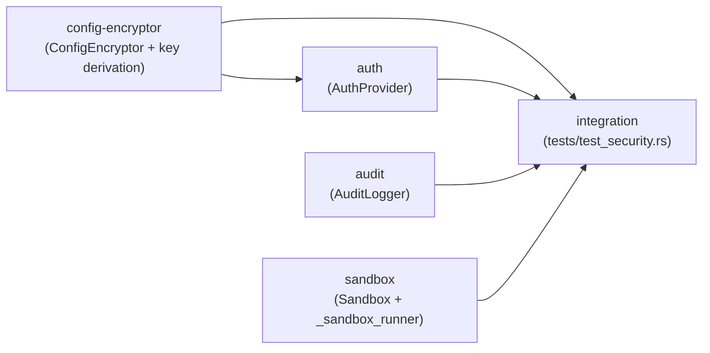

# Implementation Plan: Security Manager (Rust Port)

**Feature ID**: FE-05
**Status**: planned
**Priority**: P1 (Auth, Encryption, Audit) / P2 (Sandbox)
**Source Spec**: `apcore-cli/docs/features/security.md`
**Target Modules**: `src/security/{audit,auth,config_encryptor,sandbox}.rs`, `src/_sandbox_runner.rs`

---

## Goal

Replace all `todo!()` stubs in the four existing `src/security/*.rs` modules and `src/_sandbox_runner.rs` with correct, spec-compliant Rust implementations. The four components are:

1. **AuditLogger** — append-only JSONL execution log; write failures are non-fatal warnings.
2. **ConfigEncryptor** — credential storage via OS keyring (keyring v2) with AES-256-GCM fallback; wire format `enc:<base64(nonce‖tag‖ciphertext)>`.
3. **AuthProvider** — API key resolution from env → keyring/enc config value → config file; Bearer header injection; 401/403 error mapping.
4. **Sandbox** — module execution in an isolated `tokio::process::Command` subprocess with a restricted environment and a 300 s timeout.

All four components are already scaffolded with correct public API shapes. No public signatures are to be changed.

---

## Architecture Design

### Module Layout

```
src/security/
├── mod.rs              — pub re-exports (complete; no changes needed)
├── audit.rs            — AuditLogger implementation              [STUBS]
├── auth.rs             — AuthProvider implementation             [STUBS]
├── config_encryptor.rs — ConfigEncryptor implementation          [STUBS]
└── sandbox.rs          — Sandbox implementation                  [STUBS]
src/_sandbox_runner.rs  — run_sandbox_subprocess / encode/decode  [STUBS]
tests/
└── test_security.rs    — integration tests (to be written)
```

### Data Flow

```
CLI invoke
  │
  ├─► AuthProvider::get_api_key()
  │     ├─ env APCORE_AUTH_API_KEY (plain → return)
  │     ├─ config value "keyring:…" → ConfigEncryptor::retrieve()
  │     ├─ config value "enc:…"     → ConfigEncryptor::retrieve()
  │     └─ None → AuthenticationError::MissingApiKey (exit 77)
  │
  ├─► AuthProvider::authenticate_request(builder)
  │     └─ add Authorization: Bearer {key}
  │
  ├─► Sandbox::execute(module_id, input_data)
  │     ├─ disabled → call executor in-process
  │     └─ enabled  → tokio::process::Command (_sandbox_runner)
  │                    ├─ stdin: JSON(input_data)
  │                    ├─ stdout: JSON(result)
  │                    ├─ restricted env (PATH, APCORE_*, HOME=tmpdir)
  │                    └─ 300 s timeout
  │
  └─► AuditLogger::log_execution(module_id, input_data, status, exit_code, duration_ms)
        ├─ build JSONL entry (timestamp UTC, user, salted SHA-256 input_hash)
        └─ BufWriter<File> append; on IO error → tracing::warn!, no panic
```

### Encryption Wire Format

```
store(key, value):
  keyring available → keyring::set_password(SERVICE, key, value)
                    → return "keyring:{key}"
  keyring absent    → PBKDF2(hostname:username, salt, 100_000) → 32-byte key
                    → AES-256-GCM encrypt(value)
                    → return "enc:{base64(nonce[12] ‖ tag[16] ‖ ciphertext)}"

retrieve(config_value, key):
  starts "keyring:" → keyring::get_password()
  starts "enc:"     → base64_decode → split nonce/tag/ct → AES-256-GCM decrypt
  otherwise         → return as-is (plaintext legacy value)
```

### Key Derivation

```rust
let salt    = b"apcore-cli-config-v1";
let material = format!("{hostname}:{username}");
pbkdf2::pbkdf2_hmac::<Sha256>(material.as_bytes(), salt, 100_000, &mut key_buf);
// key_buf is [u8; 32] → Aes256Gcm::new_from_slice(&key_buf)
```

### Sandbox Environment Whitelist

| Variable | Source | Purpose |
|----------|--------|---------|
| `PATH` | host | locate apcore-cli binary |
| `LANG`, `LC_ALL` | host | locale |
| `APCORE_*` | host | apcore configuration |
| `HOME` | temp dir | prevent real-home access |
| `TMPDIR` | temp dir | isolate temp files |

(All other host variables are excluded.)

### Technology Choices

| Concern | Crate / API | Rationale |
|---|---|---|
| Keyring access | `keyring v2` | Already in `Cargo.toml`; cross-platform |
| AES-256-GCM | `aes-gcm v0.10` | Spec-mandated cipher |
| Key derivation | `pbkdf2 v0.12` + `sha2 v0.10` | Matches Python `pbkdf2_hmac("sha256", …, 100_000)` |
| Random nonce | `aes_gcm::aead::OsRng` | Cryptographically secure OS randomness |
| JSONL write | `std::io::BufWriter<File>` + `serde_json` | Buffered; spec says write failures are non-fatal |
| Subprocess | `tokio::process::Command` | Async; integrates with tokio runtime |
| Timeout | `tokio::time::timeout(Duration::from_secs(300), …)` | 300 s per spec |
| Timestamp | `std::time::SystemTime::now()` → RFC 3339 with `chrono` or manual UTC format | Must match `"2026-03-14T10:30:45.123Z"` format |
| User name | `std::env::var("USER").or_else(|_| std::env::var("LOGNAME")).unwrap_or("unknown")` | No external crate; matches spec fallback chain |
| Error types | `thiserror` | Already in `Cargo.toml`; existing error enums |

---

## Task Breakdown

### Dependency Graph



### Task List

| Task ID | Title | Estimate | Depends On |
|---|---|---|---|
| `config-encryptor` | Implement `ConfigEncryptor`: keyring probe, AES-256-GCM, PBKDF2 key derivation | ~2 h | — |
| `auth` | Implement `AuthProvider`: key resolution, Bearer injection, 401/403 mapping | ~1 h | `config-encryptor` |
| `audit` | Implement `AuditLogger`: JSONL append, salted SHA-256 input hash, user fallback | ~1 h | — |
| `sandbox` | Implement `Sandbox` + `_sandbox_runner`: subprocess isolation, env whitelist, 300 s timeout | ~2 h | — |
| `integration` | Write and pass `tests/test_security.rs` covering all T-SEC-01 through T-SEC-18 | ~1.5 h | all above |

**Total estimated time**: ~7.5 hours

---

## Risks

### 1. keyring crate behaviour differs across platforms

The `keyring v2` API returns `Error::NoEntry` when a key is absent. On Linux CI without a secret service daemon, `keyring::Entry::get_password()` may return `Error::NoEntry` or a platform-specific error even for entries that exist. Tests that hit the real keyring must be gated with `#[cfg(not(ci))]` or mocked.

**Mitigation**: The `_keyring_available()` probe (attempt a dummy get on a sentinel key) must handle any `keyring::Error` variant as "unavailable". Use `cfg(test)` mock injection or `APCORE_KEYRING_DISABLED=1` env var to force AES path in tests.

### 2. AES-GCM tag verification panics vs. error

`aes_gcm::Aes256Gcm::decrypt()` returns `aes_gcm::Error` (unit struct) on tag mismatch, not a panic. The existing `ConfigDecryptionError::AuthTagMismatch` variant correctly maps this. Care is needed when the ciphertext is shorter than 28 bytes (12 nonce + 16 tag): must check length before slicing.

**Mitigation**: Add an explicit length guard before slicing `data[..12]`/`data[12..28]`/`data[28..]` and map short-data to `ConfigDecryptionError::AuthTagMismatch`.

### 3. Sandbox subprocess binary path

The Python sandbox invokes `sys.executable -m apcore_cli._sandbox_runner`. In Rust, the subprocess must invoke the same `apcore-cli` binary with a hidden `--sandbox-runner` subcommand (or similar convention). The `_sandbox_runner.rs` file already exists as a module, not a separate binary.

**Decision**: The sandbox subprocess should invoke `std::env::current_exe()?` with an `--internal-sandbox-runner <module_id>` argument, and `main.rs` must route that argv pattern to `run_sandbox_subprocess()`. This keeps a single binary. Document this as a requirement in the `sandbox` task.

**Mitigation**: The `sandbox` task must coordinate with `main.rs` routing. The existing `_sandbox_runner.rs` must be wired as an internal subcommand, not a separate binary.

### 4. `SystemTime` → millisecond UTC timestamp formatting

Rust's `std::time::SystemTime` does not directly produce an ISO 8601 string. Options: add `chrono` (not yet in `Cargo.toml`) or format manually using `duration_since(UNIX_EPOCH)`. The type-mapping spec maps `date-time` to `chrono::DateTime<Utc>`, but `chrono` is not in the current dependency list.

**Decision**: Use `chrono` for timestamp formatting — add it to `Cargo.toml` in the `audit` task. This is the idiomatic Rust approach and matches the type-mapping spec. The format must produce `"2026-03-14T10:30:45.123Z"` (millisecond precision, `Z` suffix).

### 5. Sandbox `HOME` redirect and temp-dir cleanup

`tokio::process::Command` accepts `env()` calls but does not provide an API to clear all environment variables and then selectively re-add them. The correct approach is `.env_clear()` followed by individual `.env(k, v)` calls for each whitelisted variable.

**Mitigation**: Use `.env_clear()` then iterate the whitelist. Verify in tests that `HOME` is the temp dir and that no other host vars are present in the child env.

---

## Acceptance Criteria

- [ ] `cargo test` passes with zero failures across all test targets
- [ ] T-SEC-01: `APCORE_AUTH_API_KEY=abc123` → `Authorization: Bearer abc123`
- [ ] T-SEC-02: No API key → `AuthenticationError::MissingApiKey` (exit 77)
- [ ] T-SEC-03: HTTP 401 → `AuthenticationError::InvalidApiKey` (exit 77)
- [ ] T-SEC-04: `store()` with keyring available → config contains `keyring:auth.api_key`
- [ ] T-SEC-05: `store()` without keyring → config contains `enc:<base64>`
- [ ] T-SEC-06: `retrieve("keyring:auth.api_key", …)` → correct plaintext from OS keyring
- [ ] T-SEC-07: `retrieve("enc:<base64>", …)` → correct decrypted plaintext
- [ ] T-SEC-08: Corrupted ciphertext → `ConfigDecryptionError::AuthTagMismatch` (exit 47)
- [ ] T-SEC-09: Different hostname → key derivation produces different key; decrypt fails with `AuthTagMismatch`
- [ ] T-SEC-10: Successful execution → audit log entry has `status: "success"`, `exit_code: 0`
- [ ] T-SEC-11: Failed execution → audit log entry has `status: "error"`, correct exit code
- [ ] T-SEC-12: Audit log path unwritable → execution succeeds; `tracing::warn!` emitted; no panic
- [ ] T-SEC-13: `USER` env absent → audit entry `user` is `"unknown"` or `LOGNAME` value
- [ ] T-SEC-14: `--sandbox` flag → module runs in restricted subprocess; `HOME` env is temp dir
- [ ] T-SEC-15: Sandboxed module writes file → file appears in temp dir, not CWD
- [ ] T-SEC-16: No `--sandbox` flag → module runs in-process
- [ ] T-SEC-17: Local-only registry → no auth headers added; `get_api_key()` returns `None` variant
- [ ] T-SEC-18: Stored secret in config → value prefixed `keyring:` or `enc:`, never plaintext
- [ ] No `todo!()` macros remain in any `src/security/*.rs` file or `src/_sandbox_runner.rs`
- [ ] `cargo clippy -- -D warnings` reports no warnings in security modules

---

## References

- Feature spec: `apcore-cli/docs/features/security.md` (FE-05)
- Python reference: `apcore-cli-python/src/apcore_cli/security/{audit,auth,config_encryptor,sandbox}.py`
- Python planning: `apcore-cli-python/planning/security-manager.md`
- Type mapping spec: `apcore/docs/spec/type-mapping.md`
- Rust stubs: `apcore-cli-rust/src/security/{audit,auth,config_encryptor,sandbox}.rs`
- Sandbox runner stub: `apcore-cli-rust/src/_sandbox_runner.rs`
- SRS requirements: FR-SEC-001 through FR-SEC-004
